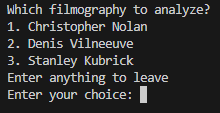
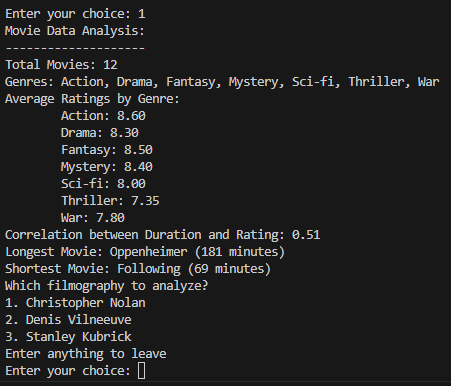

# EA2

<h1>This exploration activity is focused on the NumPy library for Python.</h1>

<h4>To start the program, run this ---> python EA2.py</h4>

This program uses premade lists of the filmography of three different directors for the data analysis.

To begin, it prompts the user to select one of the three filmographies to analyze.

After making a selection, it will shows statistics for the director's films, including: total movies, genres, average ratings by genre, correlation coefficient between the duration and rating, and finally, their longest and shortest film.

The program continues to loop and ask which director to analyze until an option is entered that doesn't show in the list.